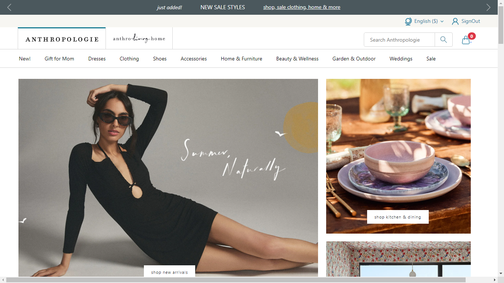
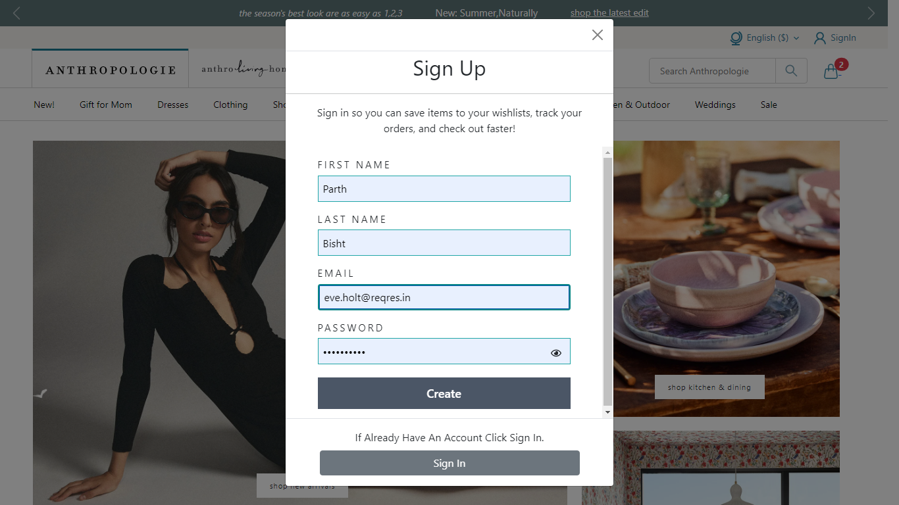
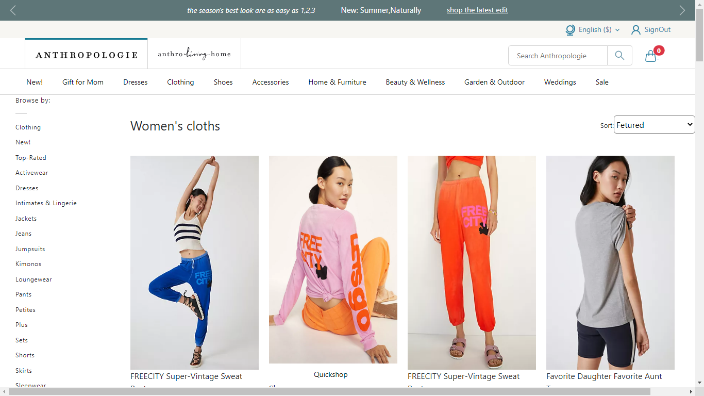
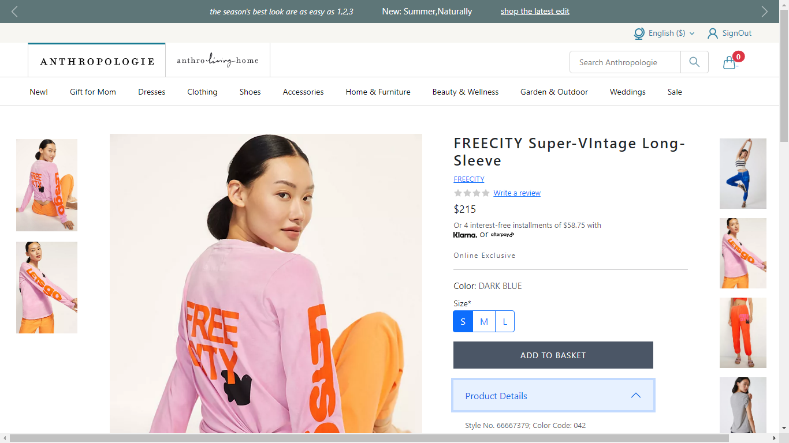
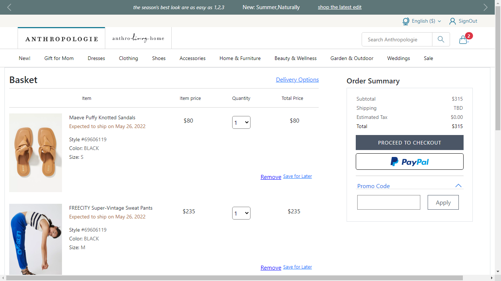

# Anthropologie.com

Anthropologie is an American clothing retailer with approximately 200 stores across the U.S. and Canada which offer an assortment of clothing, jewellery, home furniture, decoration, beauty, and gifts.

# Anthropologie clone

<h2>Landing Page</h2>

<h2>Login Page</h2>

<h2>Product Page</h2>

<h2>Single Product Page</h2>

<h2>Cart Page</h2>

<h1>[Getting Started]</h1>
    <h3>Execution</h3>
    
If you want to run our project in your local machine

    
Follow the given steps:

    <ul>
        <li>Clone our respository <a href="https://github.com/Parth-Bisht/Anthropologie-clone.git">https://github.com/Parth-Bisht/Anthropologie-clone.git</a></li>
        <li>Open our code in VS code</li>
        <li>On your terminal just write the command npm install</li>
        <li>Initialize the server by writing 'npm run server' on Terminal</li>
        <li>Than you can navigate to our website.</li>
    </ul>
        <h1>Built with</h1>
    <ul>
        <li>React.JS</li>
        <li>Bootstrap</li>
        <li>Node.JS</li>
    </ul>

        <h1>Creators</h1>
    <ul>
        <li><a href="https://github.com/Parth-Bisht">@Parth Bisht</a></li>
        <li> <a href="https://github.com/kavish729">@Kavish Chittora</a> </li>
        <li><a href="https://github.com/ShivamRathore07">@Shivam Rathore</a></li>
        <li><a href="https://github.com/SonaliBhalerao">@Sonali Bhalerao</a></li>
        <li><a href="https://github.com/naushadcom">@Md Naushad Ahamed</a></li>
        <li><a href="https://github.com/Suhani1102">@Suhani</a></li>
    </ul>  

